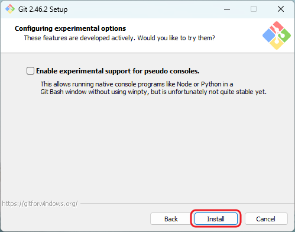

<!-- title: Git Download 깃 설치하기 가이드 -->

# Git Download 깃 설치하기 가이드

> 목차
>
> - Git 을 설치하는 방법
>
> - Git 프로필 설정 가이드

<br/>

## Git 설치 파일 다운로드

<br/>

[](https://git-scm.com/)

Git 공식 홈페이지: [https://git-scm.com/](https://git-scm.com/)

<br/>
<br/>


> 다운로드 화면으로 이동합니다.

<br/>
<br/>
<br/>
<br/>
<br/>


> 다운로드 화면으로 이동 후, 사용하고 있는 컴퓨터의 운영체제를 선택합니다.
> 
> 저는 Window 를 선택했습니다.

<br/>
<br/>
<br/>
<br/>
<br/>


> 설치 버전 유형
> - Standalone 은 설치 실행 파일입니다.
> - Portable 은 무설치 버전 실행 파일입니다.
>
> Standalone 버전을 다운로드 받아서 설치하겠습니다.

<br/>
<br/>
<br/>
<br/>
<br/>

## Git 설치 진행


> 다운로드 완료시 설치 파일을 실행합니다.
> 
> 라이센스에 동의합니다.

<br/>
<br/>
<br/>
<br/>
<br/>


> Git 이 설치되는 경로를 설정합니다.

<br/>
<br/>
<br/>
<br/>
<br/>


> 추가적으로 설치할 컴포넌트를 선택합니다.
>
> 기본적으로 선택된 컴포넌트를 그대로 설치하겠습니다.

<br/>
<br/>
<br/>
<br/>
<br/>


> Git 이 설치되는 시작 메뉴 폴더입니다. 그대로 설치하겠습니다.

<br/>
<br/>
<br/>
<br/>
<br/>


> Git 을 사용할 에디터를 설정합니다. 저는 Vim 으로 설치하겠습니다.

<br/>
<br/>
<br/>
<br/>
<br/>


> Git 의 기본 branch 이름을 설정합니다. 기본은 master 입니다. 그대로 설치하겠습니다.
>
> 요새는 main 을 기본 branch 이름으로 많이 사용하는 추세라고합니다.
>
> main 으로 하려면 밑의 라디오 버튼을 체크 해주세요

<br/>
<br/>
<br/>
<br/>
<br/>


> PATH 환경 설정 단계입니다.
>
> 다른 소프트웨어에서도 git 을 사용할 수 있게 Recommended 설정으로 설치하겠습니다.

<br/>
<br/>
<br/>
<br/>
<br/>


> Git 에서 제공하는 번들을 그대로 사용하겠습니다.

<br/>
<br/>
<br/>
<br/>
<br/>


> OpenSSL 라이브러리를 사용하겠습니다.

<br/>
<br/>
<br/>
<br/>
<br/>


> 서로 다른 운영체제간 줄 바꿈 문자를 하나로 통일하기 위해서 필요한 설정입니다.
> - checkout 할때는 줄바꿈 문자를 윈도우 스타일로 변경합니다.
> - commit 할때는 윈도우 스타일의 줄바꿈 문자를 모두 Unix 스타일의 줄바꿈 문자로 변환하여 통일하겠습니다.

<br/>
<br/>
<br/>
<br/>
<br/>


> MinTTY 터미널을 사용하여 Git Bash 를 실행하게 설정하겠습니다.

<br/>
<br/>
<br/>
<br/>
<br/>


> Git Pull 기본 동작은 fast-forward 가 가능한 경우 fast-forward 병합을 먼저 수행하고 merge 를 수행하게 설정하겠습니다.

> Fast-forward 란?
> - 두 브랜치를 병합할 때, 한 브랜치의 변경 사항이 다른 브랜치의 끝에서 이어질 수 있을 때 병합되는 방식입니다.
> - 새로운 커밋을 만들지 않고 단순히 브랜치 포인터를 앞으로 이동하여 병합합니다.
> - 추가적인 병합 커밋이 생성되지 않습니다.

<br/>
<br/>
<br/>
<br/>
<br/>


> Git Credential Manager 를 설치 합니다.
>
> Git Credential Manager 는 Git을 사용하면서 인증 정보를 안전하게 저장하고 관리하는 도구입니다.
>
> 사용자는 매번 로그인할 필요 없이 한 번 입력한 인증 정보를 이후에 자동으로 사용할 수 있습니다.

<br/>
<br/>
<br/>
<br/>
<br/>


> Enable file system caching: 파일 시스템 캐싱을 활성화하는 옵션만 선택합니다.

<br/>
<br/>
<br/>
<br/>
<br/>



> 실험적인 기능은 선택하지 않고 설치를 진행하겠습니다.

<br/>
<br/>
<br/>
<br/>
<br/>


> 설치를 완료했습니다.
>
> 이제 window 터미널을 열어서 git -- version 명령어를 통해 git 버전을 확인하실 수 있습니다.

```shell
git --version

git version 2.46.2.windows.1
```

<br/>
<br/>
<br/>
<br/>
<br/>

## Git 프로필 설정

> Git 프로필은 commit 할때 commit 을 식별하는 가장 기본적인 역할을 합니다.
> 
> Git Bash 를 실행하여 사용자 이름과 이메일을 global 로 등록해주겠습니다.
>
> 개별 프로젝트에 다른 프로필을 적용해야하는 경우에는 해당 .git 파일이 존재하는 리포지토리에서 개별적으로 프로필을 설정할 수 있습니다.

<br/>

***global : 모든 프로젝트에 적용***

```shell
git config --global user.name "Your Name"
git config --global user.email "your.email@example.com"

# 글로벌 프로필 확인
git config --global --list
```

<br/>

***local : 개별 프로젝트 별로 다르게 적용***
- '--local' 옵션이 기본 옵션이므로 명시적으로 작성하지 않아도 local 프로필을 설정할 수 있습니다.

```shell
git config user.name "Your Local Name"
git config user.email "your.local.email@example.com"

# 또는
git config --local user.name "Your Local Name"
git config --local user.email "your.local.email@example.com"

# local 프로필 확인
git config --list
```